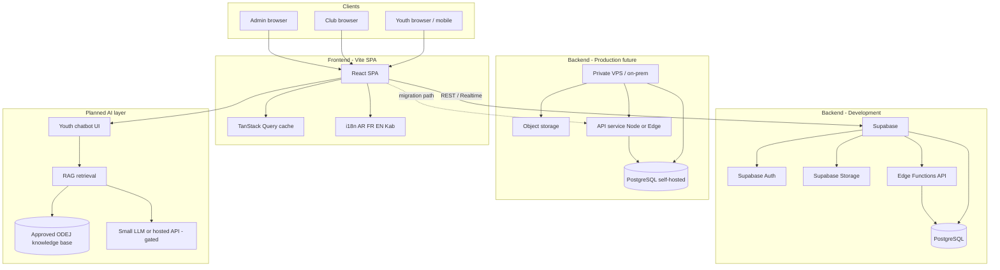
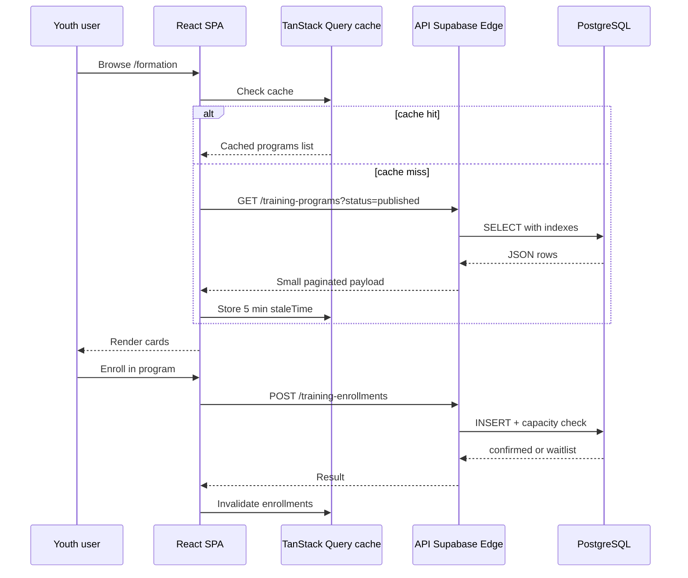
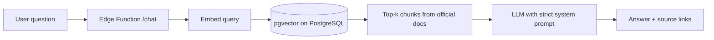

# ODEJ Platform — System Architecture & Efficiency Report

**Project:** Digital portal for the Office of Youth Institutions (ODEJ) — Wilaya of Béjaïa  
**Event alignment:** ECOHACK '26 — *Bridging Youth and Opportunities*  
**Stack (current):** React 19 · Vite 6 · TypeScript · TanStack Query  
**Stack (planned):** Supabase (development) → privately hosted PostgreSQL (production)

---

## 1. Executive summary (pitch)

We are building a **lightweight, multilingual web platform** that connects Algerian youth with ODEJ institutions, activities, training programs, Khilya services, and partnerships—without heavy apps or over-engineered AI.

| Pillar | Our approach |
|--------|----------------|
| **Eco-efficiency** | SPA + caching, small API payloads, optimized media, optional dark UI, RAG chatbot only where it adds value |
| **Accuracy & reliability** | Official content from PostgreSQL; chatbot answers from an **approved knowledge base**, not open-ended generation |
| **UX & accessibility** | Arabic (RTL), French, English, Kabyle; mobile-first; clear youth / club / admin portals |
| **Maintainability** | Admin CMS-style panels—staff update news, events, and programs **without code** |

---

## 2. Problem & solution

**Challenge (ECOHACK):** Help youth discover and access programs, activities, services, and spaces offered by ODEJ and youth establishments across Algeria.

**Our solution:**

- **Public site** — institutions map (69 wilayas), events, news, training catalog (`/formation`), Khilya, Diwan, partnerships.
- **Youth account** — register for activities, track bookings, enroll in training.
- **Club / association portal** — propose training programs; upload partnership agreement; await admin approval.
- **Admin portal** (`/portal` → `/admin`) — review clubs, publish content, manage users.
- **Planned: AI youth assistant** — answers common ODEJ questions using **verified documents only** (see §6).

---

## 3. High-level architecture

### 3.1 Current state (hackathon / demo)

- **Frontend:** Fully interactive UI with **mock API** + `localStorage` persistence for demos without a live server.
- **Backend:** Not wired yet; schema and routes are documented in `ODEJ_Platform_Integration_Guide.md`.

### 3.2 Development target — Supabase

| Service | Use |
|---------|-----|
| **PostgreSQL** | Users, institutions, events, articles, registrations, club profiles, training programs |
| **Auth** | Email/password, JWT sessions, role metadata (`public`, `club`, `admin`, …) |
| **Storage** | Club agreement PDFs, institution images, media library |
| **Edge Functions** | Thin API layer: validations, webhooks, chatbot RAG endpoint |
| **Row Level Security (RLS)** | Youth see only their data; clubs see own programs; admins see all |

### 3.3 Production target — private PostgreSQL

| Reason | Benefit |
|--------|---------|
| Data sovereignty | Youth and institutional data stay on infrastructure controlled by ODEJ / wilaya |
| Predictable cost at scale | No per-seat SaaS growth for large user bases |
| Same SQL schema | **Migrate from Supabase Postgres** with standard tools (`pg_dump` / Flyway / Prisma migrate) |

**Migration principle:** Keep **PostgreSQL-compatible SQL** and an **API contract** (REST) so the React app swaps only `VITE_API_BASE_URL`, not UI code.

---

## 4. Data flow (simplified)

**Eco note:** Pagination (`limit=12`), field selection (no huge blobs in list views), and HTTP caching headers reduce repeat compute and bandwidth.

---

## 5. Application modules (frontend)

| Portal | Route | Users |
|--------|-------|--------|
| Public site | `/`, `/institutions`, `/activites`, `/formation`, … | Everyone |
| Auth hub | `/auth` | Youth vs club entry |
| Youth dashboard | `/dashboard` | Registered youth |
| Club portal | `/club` | Approved associations |
| Admin portal | `/portal` → `/admin` | ODEJ staff |

**Roles:** `public` (youth), `club`, `khilya_staff`, `admin`, `super_admin`.

---

## 6. Planned AI chatbot (youth ODEJ assistant)

**Goal:** Answer frequently asked questions about ODEJ services, institutions, registration steps, and programs—in **Arabic and French**—without inventing facts.

### 6.1 Design principles (eco + accuracy)

| Principle | Implementation |
|-----------|----------------|
| **No hallucination** | **RAG only** — retrieve chunks from an admin-approved knowledge base (FAQ, about pages, program rules) |
| **Minimal compute** | Cache top questions; short context windows; rate limits per user |
| **Not a replacement for Khilya** | Sensitive health topics → link to `/khilya` and human counsellors |
| **Fallback** | “I don’t know” + link to `/contact` when confidence is low |
| **Audit** | Log questions (anonymized) for admins to improve FAQ content |

### 6.2 Architecture (planned)

**Content sources:** Published articles, institution pages, training FAQs, static pages from CMS—not the open web.

---

## 7. Eco-efficiency summary

Detailed checklist: **[ECOHACK_Eco_Efficiency_Practices.md](./ECOHACK_Eco_Efficiency_Practices.md)**

| Area | Choice | Carbon / energy impact |
|------|--------|-------------------------|
| Architecture | SPA + REST, not always-on heavy backend | Lower server minutes |
| Data transfer | Paginated APIs, lean JSON, image optimization | Less network energy |
| Client | TanStack Query caching, route-based code splitting (planned) | Fewer repeat requests; smaller initial load over time |
| Maps | Leaflet + OpenStreetMap tiles (vs heavy proprietary SDKs) | Lighter client |
| Media | WebP/AVIF, lazy loading, CDN in production | Smaller payloads |
| AI | RAG + cache; no LLM on every page view | Compute only when user asks |
| Hosting path | Static frontend on CDN; DB on efficient VPS | Right-sized infrastructure |

**Honest demo note:** Hackathon demo uses `localStorage` mock data—**zero backend energy** during judging, while production design targets efficient Supabase/VPS usage.

---

## 8. Accuracy & reliability (evaluation: 30%)

### 8.1 Source of truth

| Data type | Source | Who updates |
|-----------|--------|-------------|
| Institutions, events, news | PostgreSQL via admin CMS | ODEJ admin staff |
| Training programs | Club submit → admin approve → publish | Clubs + admins |
| Club accounts | Registration + agreement upload → admin approve | Clubs + admins |
| Chatbot answers | Curated knowledge base + published pages | Admins (no code) |

### 8.2 Reliability measures

| Measure | Detail |
|---------|--------|
| **Validation** | Server-side checks on enrollments (capacity, dates, roles) |
| **Idempotent actions** | Prevent double enrollment on retry |
| **Auth** | JWT + RLS; banned users blocked |
| **Backups** | Daily Postgres backups (Supabase → later automated on private DB) |
| **Monitoring** | Uptime + error tracking (e.g. Sentry) in production |
| **Chatbot guardrails** | Temperature low; cite sources; refuse medical/legal advice |

### 8.3 What we avoid

- Letting the chatbot **invent** event dates, addresses, or phone numbers.
- Client-only security (all sensitive rules enforced on API/RLS).
- Storing unnecessary PII in logs or analytics.

---

## 9. Maintainability (evaluation: 20%)

### 9.1 No-code / low-code for ODEJ staff

| Task | Admin UI | Code required? |
|------|----------|----------------|
| Publish news | `/admin/news` + editor | No |
| Manage events | `/admin/events` | No |
| Edit institutions | `/admin/institutions` | No |
| Approve clubs & view agreement | `/admin/users` | No |
| Review training programs | `/admin/training-programs` | No |
| Site settings / banners | `/admin/settings` | No |
| Update chatbot FAQ (planned) | Knowledge base admin screen | No |

### 9.2 Technical maintainability

| Practice | Benefit |
|----------|---------|
| TypeScript end-to-end | Fewer runtime errors |
| Shared API types (`src/lib/api/types.ts`) | Frontend/backend contract |
| Modular pages (`src/pages/…`) | Clear ownership per feature |
| i18n JSON files (`ar`, `fr`, `en`, `kab`) | Content separation from code |
| Open documentation | `SITE_ROUTES.md`, `MOCK_API.md`, Integration Guide |
| Environment-based config | `VITE_API_BASE_URL` for Supabase → private API switch |

### 9.3 Upgrade path

1. **Phase 1** — Mock UI (done)  
2. **Phase 2** — Supabase + real auth and RLS  
3. **Phase 3** — AI chatbot RAG + admin FAQ  
4. **Phase 4** — Migrate DB to private PostgreSQL; static frontend on national CDN  

---

## 10. Security overview (supports reliability)

- HTTPS everywhere  
- Password hashing (Supabase Auth / bcrypt)  
- Role-based routes on frontend + **RLS on database**  
- Club agreement files in private storage buckets  
- Admin actions audit log (planned table: `admin_audit_log`)  

---

## 11. Quantifiable pitch points

| Metric | Target |
|--------|--------|
| List API payload | &lt; 50 KB per page (paginated) |
| Lighthouse performance (mobile) | ≥ 85 |
| Supported languages | 4 (AR, FR, EN, Kabyle) |
| Admin content update | &lt; 5 clicks to publish an event |
| Chatbot (planned) | ≥ 80% answers from KB with citation; &lt; 2 s cached FAQ |

---

## 12. References

- ECOHACK '26 challenge brief — green technology mandate  
- [`ODEJ_Platform_Integration_Guide.md`](../../ODEJ_Platform_Integration_Guide.md) — full feature checklist  
- [`SITE_ROUTES.md`](../SITE_ROUTES.md) — implemented routes  
- [`ECOHACK_Eco_Efficiency_Practices.md`](./ECOHACK_Eco_Efficiency_Practices.md) — detailed green practices  

---

*ODEJ Béjaïa — ديوان مؤسسات الشباب · Innovating with purpose · ECOHACK '26*
